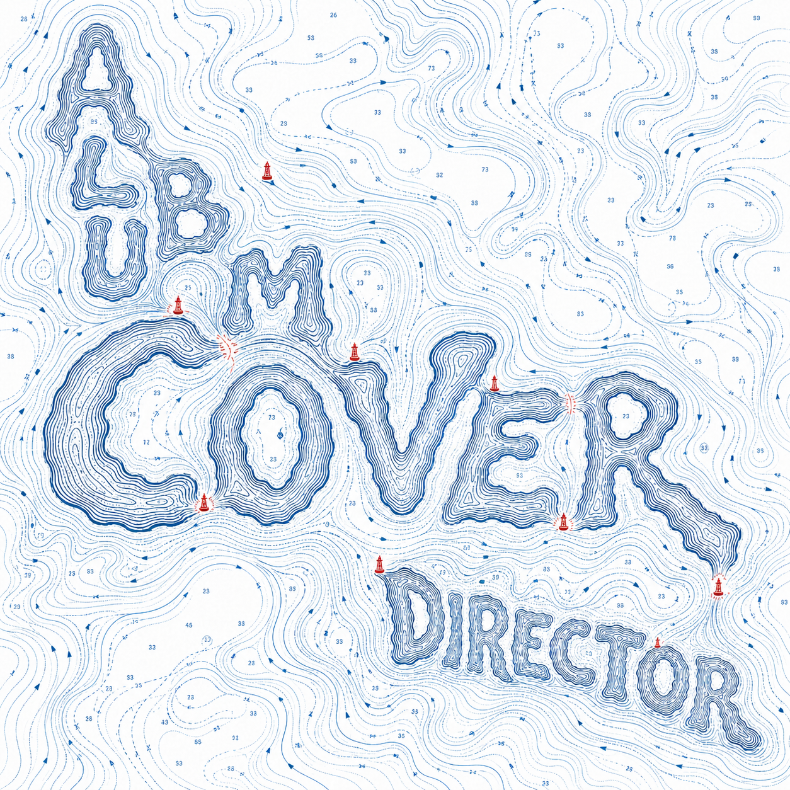
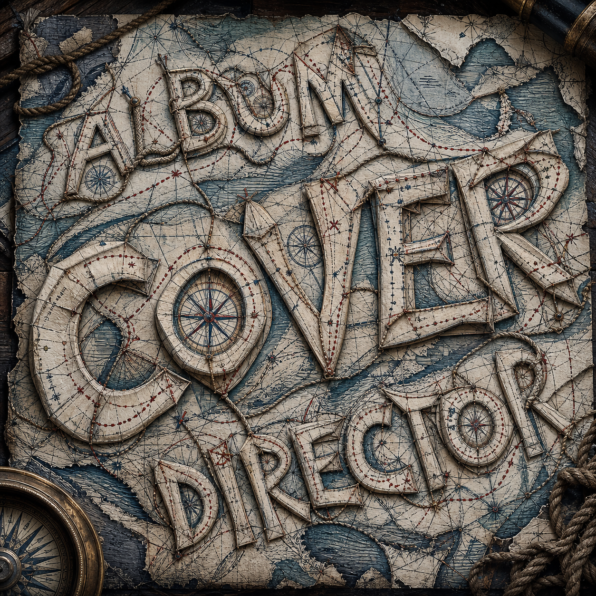
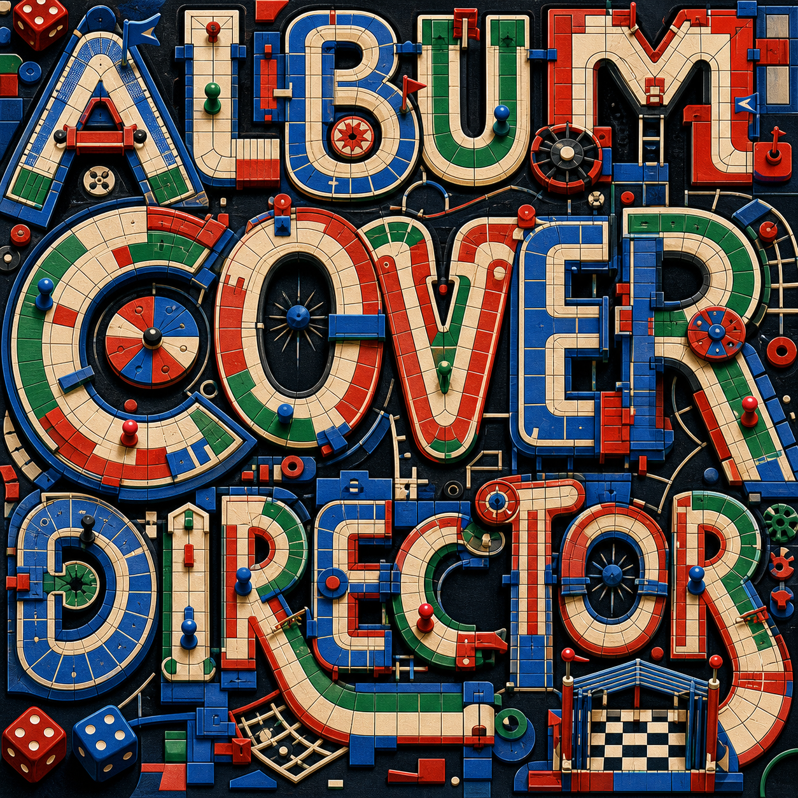
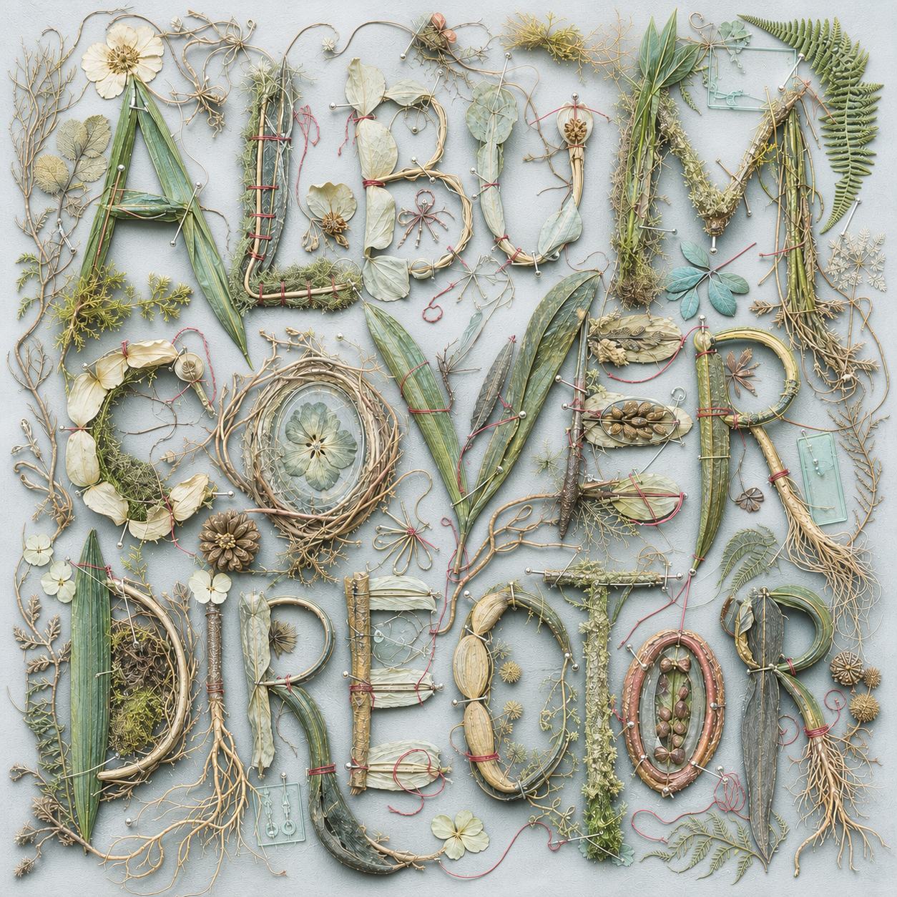
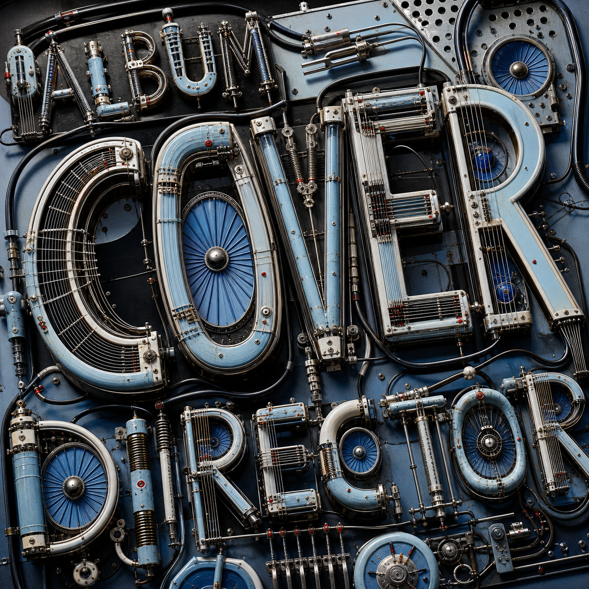
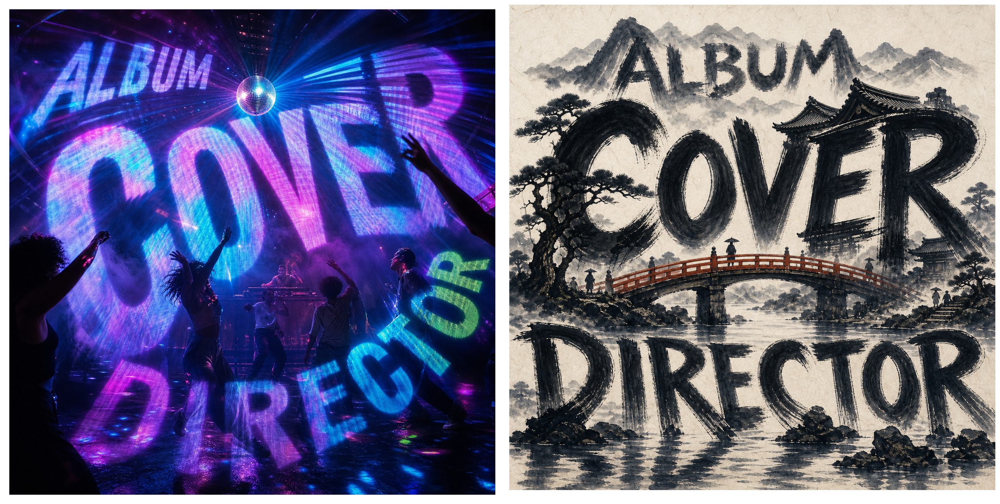
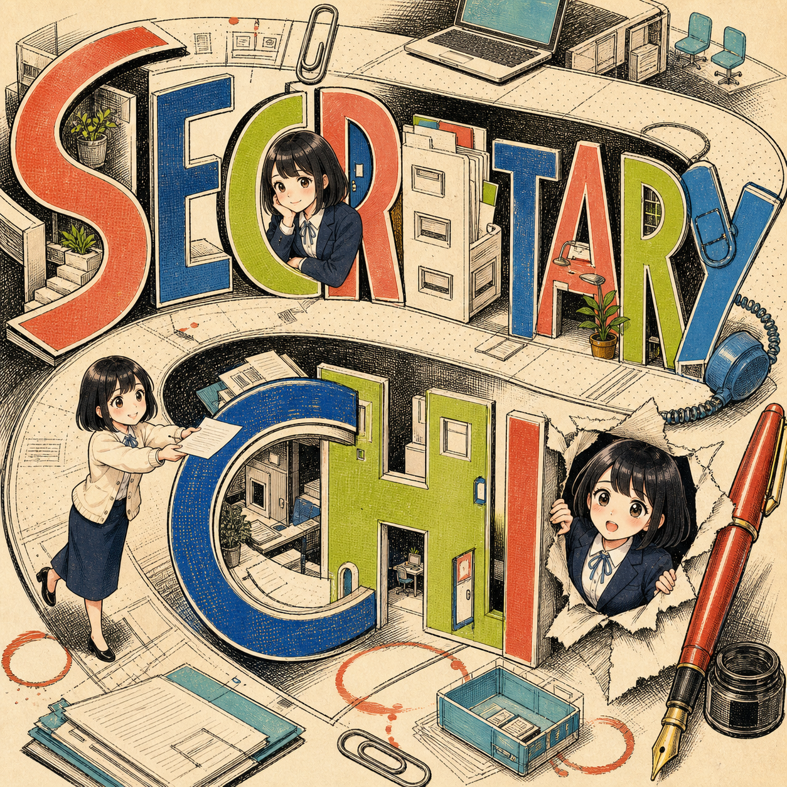
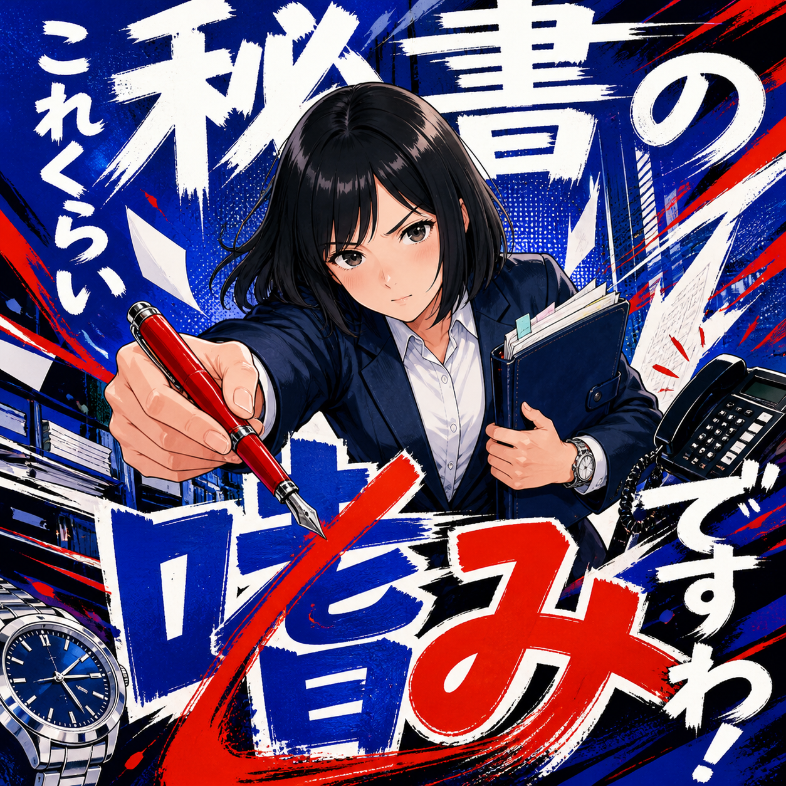
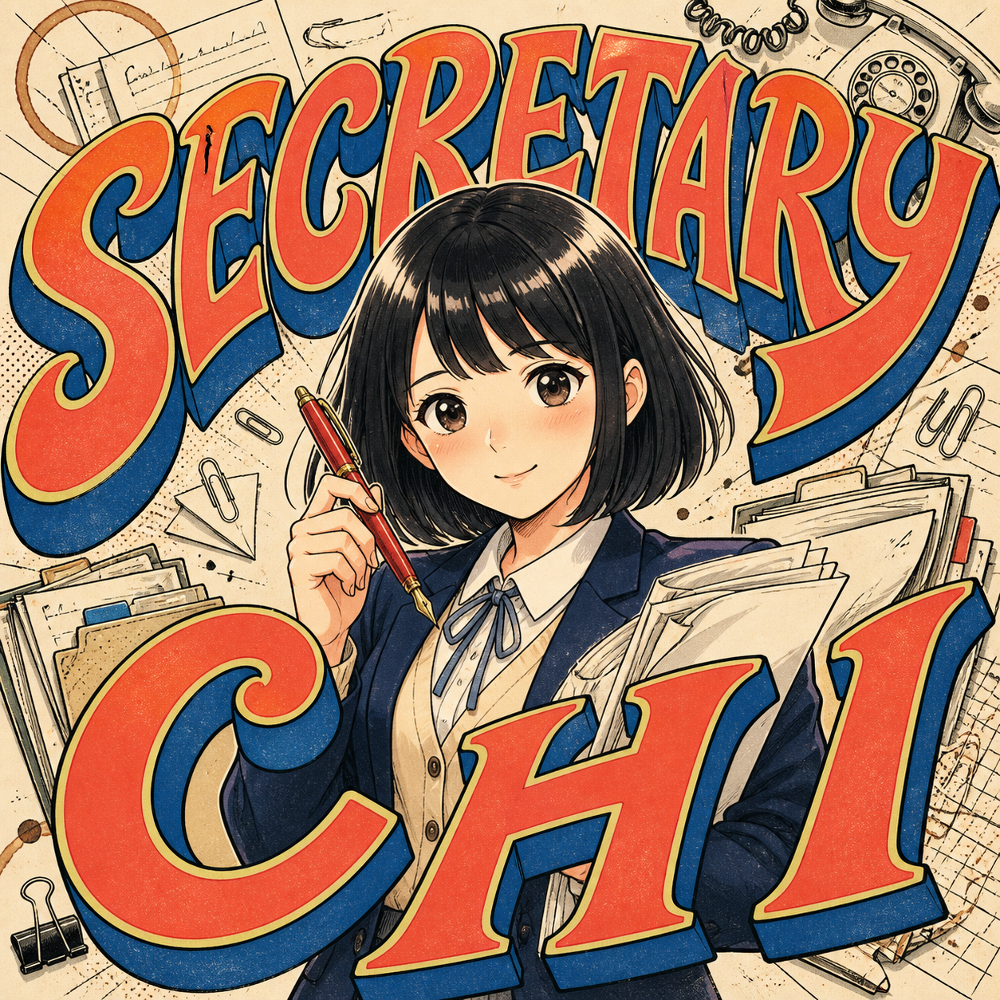
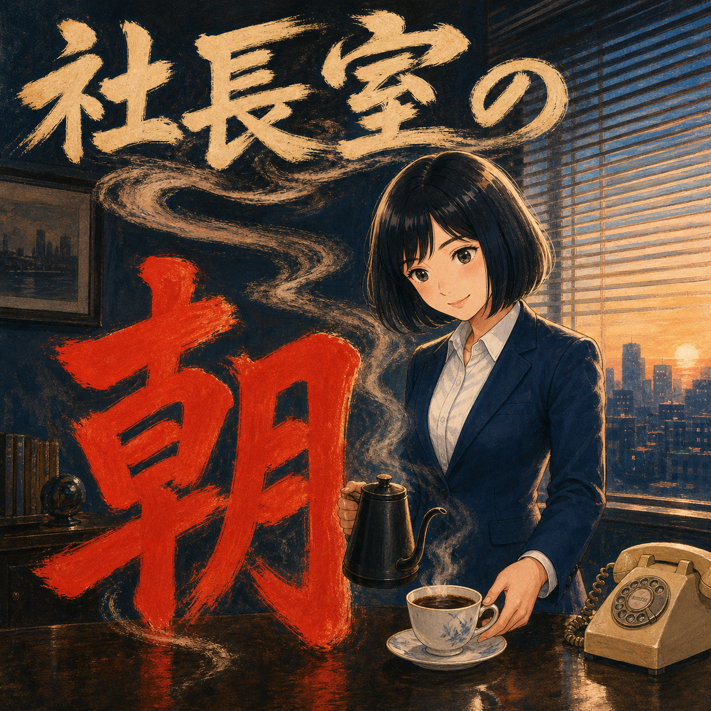

# Album Cover Director

$album-cover-director は、アルバム、EP、シングルのジャケットを構想から3000px納品までディレクションするCodex Skill / Pluginです。専門は、文字を画像の中で成立させることです。正確なタイトルを物質世界そのものにする、光・反射・空気の中で画面全体へ解き放つ、人物と同じ画面階層に置く、という3系統から選び、曲の意味を3つの異なる画面構造へ変換して、GPT Image 2で生成・比較します。

トラックメイカー、音楽家、プロデューサー、インディーレーベル、デザイナーが共通で使えることを目的にしています。特定アーティストの設定、外部MCP、APIキーは必須ではありません。

## 作れるジャケット

### 文字が物理世界になる例

|  |  |
| --- | --- |
|  |  |
| **海洋図システム** — 等深線、航路、測線が文字の骨格を決める。 | **宝の地図** — 折り目、羅針盤、索具、赤い航路が題字を工作物にする。 |
|  |  |
| **ボードゲーム** — タイル、コース、橋、コマが文字を遊べる構造にする。 | **植物標本** — 根、押し花、花弁、ピン、糸が文字を成長させる。 |

**機械音響システム** — 配管、ばね、共鳴器、配線が高密度な題字の工作物を組み上げる。

### 文字が空間現象になる型

**回転する光のフィールド** — 小さなミラーボール、投影文字、スモーク、ダンサーがクラブ全体を一つの題字空間にする。文字の骨格は読ませたまま、光・空気・動きが画面の中へ題字を拡散する。

**水墨景観のフィールド** — 太い筆の英字骨格が、山、屋根、橋、川、霧、水面へ広がる。

### キャラクターと題字を一体化する4型

|  |  |
| --- | --- |
|  |  |
| **タイトル＝地図** — 文字そのものが世界になる。 | **キネティック・ワードマーク** — ジェスチャーと題字が一つの動きになる。 |
|  |  |
| **ヒーロー・ワードマーク** — 人物とタイトルが同じ階層を支配する。 | **日本語の階層** — 導入の文字列から、巨大な一文字へ展開する。 |

ここにある題字はすべて画像の中で同時に生成されています。題字の素材・構造・画像は一つのデザイン判断であり、後からフォント、描き直し、後組版、合成で直すことはありません。

この11例は、同格の3系統を示します。**物質タイトル世界**は、航路、工作物、ゲーム、標本などが文字の骨格を作る系統。**空間フィールド**は、光、反射、スモーク、動き、天候、建築が題字を正方形全体へ拡散・変形する系統。**キャラクター主導**は、入力されたartist systemや楽曲briefが人物を必要とするとき、人物の姿勢・行為・世界と題字を一つの構造にする系統です。空間フィールドでは、読み順のために通常の文字骨格を使ってよいですが、画像内で生成され、空間現象によって変形されなければなりません。完成したシーンの上に平らな文字を置くことは、どの系統でも認めません。

## 特徴

- 物質タイトル世界、空間フィールド、キャラクター主導という、3つの画像内題字システム
- スタイル名ではなく「何が正方形を組織するか」を表す12の補助パターン
- 色違いではなく構造が異なる3方向
- 文字を後から足さず、画像の中でタイトルを成立させる独立ゲート
- ライブや空間を描く場合は、題字の面積・骨格・読み順・明暗優先度を先に固定し、その周辺だけに光、スモーク、動き、反射、トリミングの揺らぎを使う
- 56px、128px、256px、原寸、グレースケール、ぼかしの比較
- 1回1変数、最大2サイクルの修正
- 3000 x 3000 PNG/JPGと256pxサムネイルの再現可能な書き出し

## インストール

Codexに次のように依頼できます。

~~~text
次のGitHubリポジトリから album-cover-director スキルをインストールして:
https://github.com/usedhonda/album-cover-director/tree/main/skills/album-cover-director
~~~

手動の場合:

~~~bash
git clone https://github.com/usedhonda/album-cover-director.git
mkdir -p ~/.agents/skills
ln -s "$PWD/album-cover-director/skills/album-cover-director" ~/.agents/skills/album-cover-director
~~~

インストール後にCodexを再起動してください。リポジトリ直下は .codex-plugin/plugin.json を備えたPlugin bundleでもあり、CodexのPlugin marketplaceへ内容を組み替えず掲載できます。

## 使い方

~~~text
$album-cover-director
作品名: Glass Weather
実行量: standard
歌詞: ...
アーティスト情報: /path/to/artist-information.md
参考画像: /path/to/character.png
画像の使い方: 同じキャラクターとして使い、構図や場面は曲ごとに変える
~~~

自然文でも起動します。

~~~text
この新曲のジャケットを歌詞から6枚作って。
色違いではなく構造の違う3方向にして、3000pxで納品して。
~~~

必須入力は一つだけです。

- 正確な作品名

歌詞とアーティスト情報は任意です。歌詞はプロンプト本文への貼り付けとファイルパス指定の両方に対応します。アーティスト情報には、名前、ジャンル、曲調、強調したい要素、継続キャラクター、画風、色彩、題字方針、避けたい表現、参考情報などを自由に含められます。何も追加されなければ、作品名だけから制作を進めます。

参考画像も任意です。画像を添付するかファイルパスを指定し、同じ人物・キャラクターとして使う、画像そのものを加工して使う、雰囲気だけを参考にする、のいずれかを指定できます。明確な場合はSkillが意図を判定します。同じキャラクターを継続しても、ポーズ、行動、場面、構図、光、色、題字構造は曲ごとに作り直します。実画像そのものを使う場合は、利用権限のある画像だけを対象にします。

アーティスト情報をファイルパスで指定した場合、その読み取り可能な直近パスだけをローカルに記憶し、次回省略時に再利用します。ファイル内容、歌詞、歌詞パス、作品名、参考画像、画像パスは記憶しません。新しいアーティスト情報パスを指定すれば置き換わり、一時的に無視することも、記憶を削除することもできます。

実行量は quick=3枚、standard=6枚、deep=12枚。文字モードは auto、image-native、custom-wordmark です。題字システムは auto、material-world、spatial-field、character-led から選べます。評価に出す各候補は、正確なタイトルがジャケット画像と一体化した完成候補です。タイトルは画像生成と同時に成立させ、あとからフォント、描き直し、合成で足しません。

## タイトルを画像にする

タイトルを主役にする場合は、フォント名から始めません。次のいずれか一つの構図を選び、そこから曲固有の世界を発生させます。

- タイトル＝地図／世界の骨格
- タイトル＝中心モチーフを包む輪郭
- タイトル＝巨大なワードマークと記録痕のフィールド
- タイトル＝描画を侵食する記録痕
- タイトル＝中央メダリオンを公転する軌道
- タイトル＝光、反射、スモーク、動き、建築へ広がる空間フィールド

各構図は、タイトルの占有率、読み順、中心モチーフとの関係、歌詞モチーフの配置、GPT Image 2への指示、失敗条件まで定義します。参照画像があっても、固有の文字・配色・モチーフ・配置を写さず、文字と画像の関係だけを曲固有の選択へ翻訳します。詳細は [title-image-architectures.md](skills/album-cover-director/references/title-image-architectures.md) を参照してください。

## 文字設計

custom-wordmark ではフォント名だけを指定しません。骨格、幅、太さ、カウンター、端部、リズム、加工原理を定義し、それを画像生成の指示に組み込みます。正確な綴り、字間、行間、ベースラインを満たさないAI生成文字は採用せず、タイトル画像の構造、各文字の位置、読み順、色、占有率を具体化して再生成します。

完成条件は、128pxで読めることに加え、画像を隠してもタイトル造形として成立することです。

## 成果物

~~~text
album-cover/<release-slug>/
├── creative-brief.yaml
├── directions.md
├── prompts/
├── run-ledger.jsonl
├── selected-master.png
├── delivery/cover-3000.png
├── delivery/cover-3000.jpg
├── delivery/thumbnail-256.png
└── cover-report.md
~~~

画像生成環境またはPillowがない場合、完成したbrief、方向案、prompt、正確な書き出し仕様までは返しますが、「納品完了」とは表示しません。

## 研究と著作権

[research/corpus.yaml](research/corpus.yaml) は置換予定の旧ドラフトであり、制作時の正本ではありません。現在の限定教材セットは、根拠完備候補から抽出した [verified-principles.md](skills/album-cover-director/references/verified-principles.md) にあります。これは今の制作判断を良くするためのもので、制作中に前例収集を続ける理由にはしません。第三者のジャケット画像は収録しません。

新コーパスの採用条件は、ジャケット固有の評価根拠、文字支配度T4/T5、実物視覚確認、作品固有の転用原理です。名盤順位、売上、音楽的知名度はジャケット評価の根拠にしません。将来の拡張は、実際のカバー制作で同じ不足が繰り返し確認された場合だけに行い、音楽ジャンルの網羅を目的にしません。

[genre-diverse-title-intake.md](research/genre-diverse-title-intake.md) は、追加収集を6件で止めた独立の発見用ノートです。ここにあるリンクと観察は、私的なカバー試作で既存構図と異なる有効性を示すまで、制作ルールにはなりません。

[typography-led-genre-intake.yaml](research/typography-led-genre-intake.yaml) には、画像検索と目視確認で選んだ主要ジャンル横断の文字主導ジャケット候補を収録しています。第三者画像は保存せず、作品情報、参照ページ、文字が正方形を組織する方法、転用時の検証質問だけを記録します。候補は実制作の対比較と未使用briefで再現するまで、発見用のままです。

## 検証

~~~bash
python scripts/validate_repo.py
python -m unittest discover -s tests -v
~~~

CIではSkill frontmatter、Plugin manifest、旧ドラフト／最終コーパスの明示状態、研究チェックポイントと分布、リンク形式、第三者画像の不在、秘密情報・ローカル絶対パスの不在を検査します。

## ライセンス

コード、指示、スキーマ、独自観察は[MIT License](LICENSE)です。第三者のアルバム画像は含まず、再ライセンスもしません。
